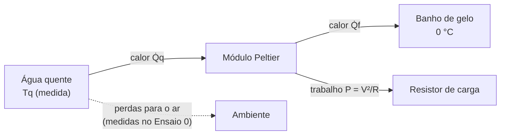
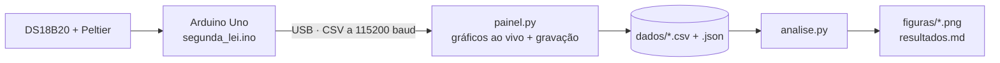
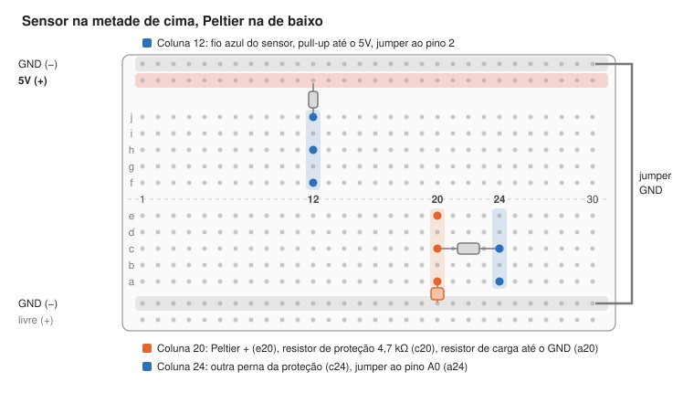

# Verificação experimental da Segunda Lei da Termodinâmica

Um módulo Peltier entre água quente e gelo, um Arduino medindo e um programa em Python fazendo as contas: dados reais mostrando que o calor só flui espontaneamente do quente para o frio, que ele nunca vira trabalho por inteiro e que a entropia do universo aumenta.

<!-- Adicionar aqui foto do experimento completo. Salve em docs/fotos/montagem.jpg -->


## Sumário

- [Propósito](#propósito)
- [Como funciona](#como-funciona)
- [Fundamentação teórica](#fundamentação-teórica)
- [Stack](#stack)
- [Estrutura do repositório](#estrutura-do-repositório)
- [Como reproduzir](#como-reproduzir)
- [Procedimento experimental](#procedimento-experimental)
- [Resultados](#resultados)
- [Limitações e lições aprendidas](#limitações-e-lições-aprendidas)
- [Autores](#autores)

## Propósito

Projeto da disciplina de Física Térmica do curso de Engenharia da Computação no CEFET/RJ, disciplina regida por Rogério Wanis, um objeto de estudo ligado ao Capítulo 19 do livro "Física - Uma abordagem estratégica" de Randall Knight  (enunciados de Kelvin-Planck e de Clausius, equivalência entre eles e conexão com a entropia).

O objetivo é verificar com medidas, e não só com teoria, três afirmações:

1. **Clausius:** o calor flui espontaneamente apenas do corpo quente para o frio.
2. **Kelvin-Planck:** nenhuma máquina converte integralmente em trabalho o calor retirado de um reservatório; sempre há rejeição de calor para um reservatório mais frio, e a eficiência fica abaixo do limite de Carnot.
3. **Entropia:** a produção de entropia do universo é sempre positiva, mesmo com a energia se conservando.

## Como funciona

Um módulo termoelétrico (Peltier TEC1-12706) fica prensado entre duas caixas de metal: uma com água quente e outra com um banho de gelo, que permanece a 0 °C enquanto houver gelo derretendo. O calor atravessa o módulo do quente para o frio e, pelo efeito Seebeck, gera uma tensão elétrica. Com um resistor ligado aos terminais, o módulo realiza trabalho elétrico: é uma máquina térmica sem partes móveis.



O Arduino mede só três coisas, uma vez por segundo: o tempo, a temperatura da água quente (sensor DS18B20) e a tensão no resistor (pino A0). Toda a física é calculada depois, em Python, a partir desses dados brutos.



## Fundamentação teórica

A água funciona como reservatório: conhecendo a massa $m$, o calor específico $c$ e a rapidez com que a temperatura muda, obtém-se a potência térmica.

$$\dot Q = m\,c\,\left|\frac{dT}{dt}\right|$$

A eficiência de uma máquina térmica é a fração do calor retirado da fonte quente que vira trabalho, e nenhuma máquina operando entre duas temperaturas supera o limite de Carnot (temperaturas em kelvin):

$$\eta = \frac{W}{Q_q} \qquad\qquad \eta_C = 1 - \frac{T_f}{T_q}$$

Quando um reservatório à temperatura $T$ troca calor, sua entropia varia $dS = dQ/T$. A taxa de produção de entropia do universo é

$$\dot S_{ger} = \frac{\dot Q_f}{T_f} - \frac{\dot Q_q}{T_q} \;\geq\; 0$$

Os enunciados de Clausius e de Kelvin-Planck são casos particulares dessa desigualdade. O contraste central do projeto é que a energia se conserva ($\dot Q_q = P + \dot Q_f$), mas a entropia só aumenta.

## Stack

| Camada | Tecnologia | Função |
| --- | --- | --- |
| Microcontrolador | Arduino Uno R3 | Lê o sensor e a tensão, envia os dados pela USB |
| Firmware | C++ (Arduino) com as bibliotecas OneWire e DallasTemperature | Comunicação com o DS18B20 e saída em CSV |
| Aquisição | Python 3, pyserial, Tkinter, matplotlib | Painel com gráficos ao vivo e gravação dos ensaios |
| Análise | Python 3, numpy, pandas, scipy (filtro Savitzky-Golay), matplotlib | Perdas, fluxos de calor, eficiências, entropia e figuras |
| Simulação | [Wokwi](https://wokwi.com) | Teste do circuito e do código antes do hardware |

**Hardware**

| Item | Qtd. | Função |
| --- | --- | --- |
| Arduino Uno R3 + cabo USB | 1 | Aquisição de dados |
| Sensor DS18B20 à prova d'água | 1 | Temperatura da água quente (resolução de 0,0625 °C) |
| Resistor 4,7 kΩ | 2 | Pull-up do barramento 1-Wire e proteção do pino A0 |
| Módulo Peltier TEC1-12706 | 1 | A máquina térmica |
| Resistor de potência 2,2 Ω, 5 W | 1 | Carga que recebe o trabalho elétrico |
| Protoboard de 400 pontos e jumpers | 1 | Montagem sem solda |
| Duas caixas de metal com parede plana, pasta térmica, presilhas | — | Reservatórios e contato térmico |

## Estrutura do repositório

```text
segunda-lei-peltier/
├── README.md
├── resultados.md            ← gerado pela análise (tabela de resultados)
├── requirements.txt
├── arduino/
│   ├── segunda_lei/         ← firmware do experimento
│   ├── diagnostico/         ← testa se o sensor é encontrado e alimentado
│   └── teste_pino/          ← testa o fio de dados sem multímetro
├── python/
│   ├── painel.py            ← painel de aquisição (janela com gráficos ao vivo)
│   ├── grava.py             ← gravador simples pelo terminal (plano B)
│   └── analise.py           ← análise completa dos ensaios
├── dados/                   ← arquivos brutos de cada ensaio (.csv + .json)
├── figuras/                 ← gráficos gerados pela análise
├── simulacao/wokwi/         ← projeto pronto para o simulador Wokwi
└── docs/
    ├── montagem.md          ← guia de montagem e problemas comuns
    ├── protoboard.svg       ← mapa das ligações
    └── fotos/
```

## Como reproduzir

1. **Monte o circuito** seguindo o [guia de montagem](docs/montagem.md). O mapa resume as ligações:

   

2. **Carregue o firmware.** Na Arduino IDE, instale as bibliotecas OneWire (Paul Stoffregen) e DallasTemperature (Miles Burton) pelo gerenciador de bibliotecas, abra `arduino/segunda_lei/segunda_lei.ino` e carregue na placa.

3. **Instale as dependências do Python:**

   ```bash
   pip install -r requirements.txt
   ```

4. **Grave os ensaios** com o painel (feche antes o Monitor Serial da Arduino IDE):

   ```bash
   cd python
   python painel.py
   ```

   Escolha a porta, preencha o nome do ensaio (`ensaio0`, `ensaio1` ou `ensaio2`), a massa de água e o resistor, e clique em Iniciar. Os arquivos vão para `dados/`.

5. **Rode a análise**, informando a temperatura ambiente medida:

   ```bash
   python analise.py --tamb 24.5
   ```

   Ela usa os arquivos mais recentes de cada ensaio e gera `figuras/*.png` e `resultados.md`.

**Sem hardware:** abra o [Wokwi](https://wokwi.com), crie um projeto com Arduino Uno e cole o conteúdo de `simulacao/wokwi/` (o `sketch.ino`, o `diagram.json` e as bibliotecas do `libraries.txt`). O potenciômetro faz o papel da tensão do Peltier.

## Procedimento experimental

Todos os ensaios usam a mesma massa de água quente, a mesma temperatura inicial (água fervida e esperada por 3 minutos, cerca de 60 °C) e as mesmas condições de bancada. As duas caixas são mexidas a cada minuto.

| | Ensaio 0 | Ensaio 1 | Ensaio 2 |
| --- | --- | --- | --- |
| Caixa quente | Água quente | Água quente | Água quente |
| Caixa fria | **A mesma água quente** | Gelo picado com pouca água | Gelo picado com pouca água |
| Resistor de carga | Desconectado | Desconectado | Conectado |
| O que mede | Perdas para o ambiente | Fluxo espontâneo de calor (Clausius) | Conversão de calor em trabalho (Kelvin-Planck) |

**Por que o Ensaio 0 tem água quente dos dois lados:** com as duas faces do Peltier na mesma temperatura, não passa calor pelo módulo, e a caixa quente perde calor só para o ar. Isso mede a perda em cada temperatura sem precisar desmontar o sanduíche, e ainda serve como teste do reservatório único: sem diferença de temperatura, a tensão fica em zero (Kelvin-Planck). Na análise, essa perda é ajustada por $\text{perda}(T) = a\,\Delta T + b\,\Delta T^2$, com $\Delta T = T - T_{amb}$, e descontada dos Ensaios 1 e 2.

## Resultados

<!-- rode `python python/analise.py --tamb <temperatura ambiente>` e cole aqui a tabela de resultados.md -->

_(a preencher com a tabela de [`resultados.md`](resultados.md))_

**Comparação dos três ensaios.** Com o Peltier ligado ao gelo, a água quente esfria mais rápido do que só perdendo calor para o ar: a diferença é o calor que atravessa o módulo.


**Ensaio 0 — perdas para o ambiente.**


**Ensaio 1 — sem carga.** Calor fluindo do quente para o frio, produção de entropia positiva e tensão em aberto proporcional à diferença de temperatura (efeito Seebeck).


**Ensaio 2 — com carga.** O módulo gera trabalho, mas o gelo continua recebendo calor, e a eficiência real fica muito abaixo do limite de Carnot.


### Discussão

<!-- explicar a relação do experimento com esses tópicos: -->
<!-- 1. Clausius: a água quente esfriou e o gelo derreteu em todos os ensaios; nunca o contrário. -->
<!-- 2. Kelvin-Planck: eficiência real (≈ x %) contra limite de Carnot (≈ y %); o gelo continuou recebendo calor com a carga ligada. -->
<!-- 3. Entropia: Ṡ > 0 em z % dos pontos, também considerando perdas ±20 %. -->
<!-- 4. Reservatório único: tensão nula no Ensaio 0. -->

_(a preencher)_

## Limitações e lições aprendidas

**Limitações do experimento**

- **Perdas grandes para o ambiente.** As caixas ficaram sem isolamento e sem tampa, então a água quente perdeu muito calor por evaporação e convecção, uma perda da mesma ordem do calor que atravessou o Peltier. Ela foi medida no Ensaio 0 e descontada, mas domina a incerteza da conta da entropia; por isso os resultados são apresentados com a faixa correspondente a perdas 20 % menores ou maiores.
- **Contato térmico imperfeito.** As paredes das caixas são levemente inclinadas, e o módulo encostou só em parte da área. Com cerca de 0,2 V medidos para quase 60 °C entre as águas, estima-se que apenas alguns graus dessa diferença chegaram às faces do módulo; o resto se perdeu nos contatos.
- **Um único sensor.** O lado frio é assumido a 0 °C (banho de gelo com gelo sobrando), e o calor que chega a ele é obtido pelo balanço de energia, $\dot Q_f = \dot Q_q - P$.
- **Resolução da tensão.** Na referência de 5 V, o conversor do Arduino enxerga degraus de cerca de 5 mV, que aparecem como uma escada nos gráficos de tensão.
- **Máquina não reversível.** O módulo não opera num ciclo de Carnot: o experimento ilustra os enunciados, mas não reproduz uma máquina ideal.

## Autores
Mateus de Souza Fonseca - [Linkedin](https://www.linkedin.com/in/mateus-souza-fonseca/)
